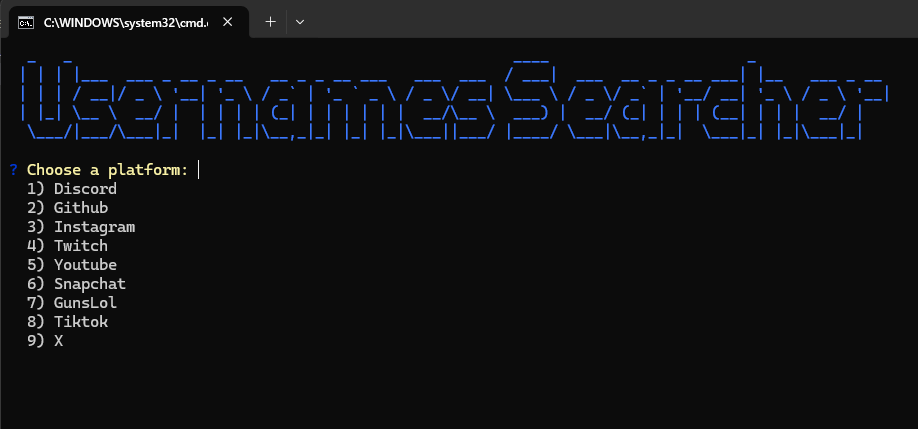
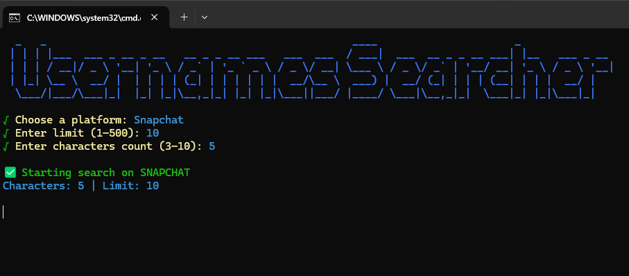

# 🎯 Username Searcher

**Username Searcher** is a tool designed to search for available usernames across multiple platforms. It helps users quickly find free usernames without checking each website manually.

---

## 🔹 How It Works

The tool is divided into **three main methods**:

### 1️⃣ Status Checking

- For platforms like **YouTube, GitHub, and Snapchat**, the tool performs **status checks** to quickly determine if a username exists or not.
- This is the fastest method for platforms that allow simple status detection.

### 2️⃣ API Checking

- For platforms that provide APIs, such as **Discord**, the tool uses **official API endpoints** to reliably verify username availability.

### 3️⃣ Playwright Automation

- For platforms without a proper API, such as **TikTok, Twitch, X, Instagram, and Guns.lol**, the tool uses **Playwright** to automate the browser and check usernames directly on the website.

---

## ⚠ Important Notes

- Some platforms **restrict 3-character usernames**. Even if a username appears available, the platform may prevent claiming it due to current policies.
- Playwright checks may be **sensitive to UI changes**, which can cause false positives or negatives.
- Always **respect platform rules and rate limits**.

---

## 🖼 Tool

**Example: When the tool run**



**Example: Checking usernames on Snapchat**



---

## 💻 Example Start
You can simply click the run file to start the tool

Or: 

```bash
npm start
```

## Install Project: 
```bash
git clone https://github.com/username/UsernameSearcher.git
```

